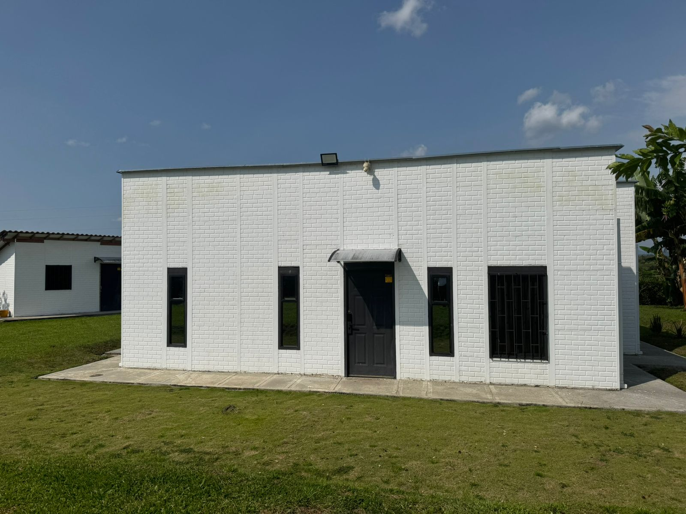
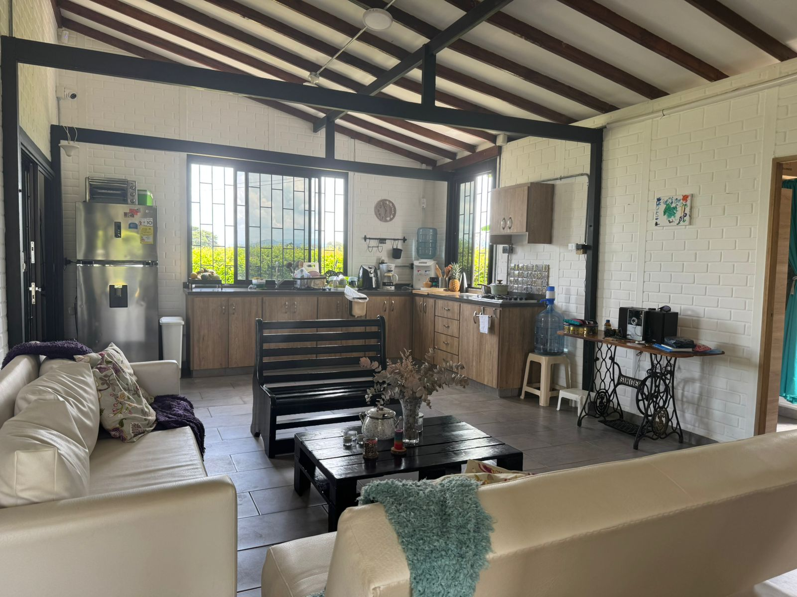
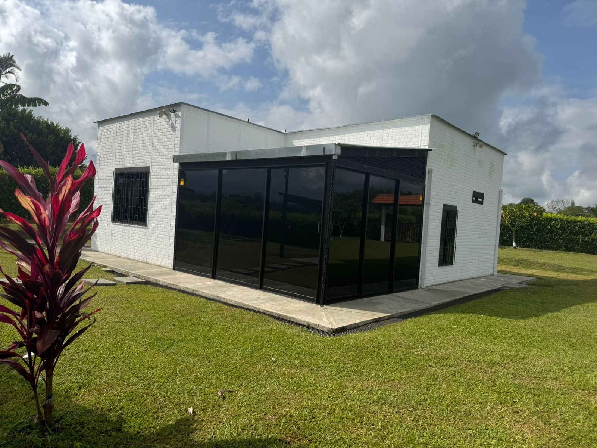

# 🌿 Casa de Campo Sostenible — Alcalá, Valle del Cauca

Sitio web de venta para una casa de campo sostenible ubicada en la Vereda La Unión, Alcalá, Valle del Cauca (Eje Cafetero, Colombia).

🌐 **Sitio en vivo:** [casacampoalcala.co](https://casacampoalcala.co)

### 🌍 Disponible en 3 idiomas

| Idioma | URL |
|--------|-----|
| Español | [casacampoalcala.co](https://casacampoalcala.co) |
| English | [casacampoalcala.co/en/](https://casacampoalcala.co/en/) |
| Français | [casacampoalcala.co/fr/](https://casacampoalcala.co/fr/) |

---

## 📸 Vista previa

| Exterior | Interior | Zona Social |
|----------|----------|-------------|
|  |  |  |

---

## 🏡 Sobre la propiedad

| Dato | Valor |
|------|-------|
| Área construida | 85 m² |
| Lote total | 1.254 m² |
| Habitaciones | 2 |
| Baños | 2 |
| Bodega | 12 m² (ampliable) |
| Energía | 100% solar |
| Internet | Satelital |
| Seguridad | CCTV instalado |
| Precio | $590.000.000 COP (~USD 143.000) |
| Ubicación | Vereda La Unión, Alcalá, Valle del Cauca |

---

## 🛠️ Stack técnico

Este es un sitio web estático de una sola página (SPA), optimizado para rendimiento y SEO.

| Componente | Tecnología |
|------------|------------|
| **Estructura** | HTML5 semántico |
| **Estilos** | CSS3 inline (custom properties, grid, flexbox) |
| **JavaScript** | Vanilla JS (slider hero, galería lightbox, formulario WhatsApp, toggle galería móvil) |
| **i18n** | Multilenguaje (ES, EN, FR) con archivos separados + meta hreflang |
| **Hosting** | [Netlify](https://www.netlify.com/) |
| **Dominio** | casacampoalcala.co |
| **Seguridad** | Headers configurados en `netlify.toml` (HSTS, CSP, X-Frame-Options) |

**Sin dependencias externas** — no utiliza frameworks, librerías ni CDNs.

---

## 📁 Estructura del proyecto

```
WebVentaCasaCampo/
├── index.html                          # Página principal en español
├── en/
│   └── index.html                      # English version
├── fr/
│   └── index.html                      # Version française
├── netlify.toml                        # Configuración de Netlify (headers de seguridad)
├── Estrategia-Redes-Sociales.md        # Plan de marketing en redes sociales
├── Imagenes/
│   ├── 01-Exterior-Fachada/            # Fachada y vistas exteriores (17 fotos)
│   ├── 02-Jardin-Lote/                 # Jardín, lote y portón (7 fotos)
│   ├── 03-Zona-Social-Vidriada/        # Terraza y zona social (8 fotos)
│   ├── 04-BBQ-Kiosco-Parqueadero/      # BBQ, pérgola y parqueadero (4 fotos)
│   ├── 05-Sala-Comedor/                # Sala y comedor interior (5 fotos)
│   ├── 06-Cocina/                      # Cocina semi-integral (3 fotos)
│   ├── 07-Habitaciones/                # Habitaciones (2 fotos)
│   ├── 08-Banos/                       # Baños (1 foto)
│   ├── 09-Bodega/                      # Bodega 12 m² (6 fotos)
│   ├── 10-Cuarto-Servicios/            # Cuarto de servicios (1 foto)
│   ├── 11-Videos/                      # 3 videos tour (exterior, interior, zona social)
│   └── 12-Paneles-Solares/             # Sistema de energía solar (4 fotos)
└── README.md
```

---

## 🧩 Secciones del sitio

1. **Hero** — Slider con 8 fotos principales, precio y CTA
2. **Beneficios** — 6 cards (energía solar, conectividad, privacidad, Airbnb, lista para habitar, ampliación)
3. **Ficha técnica** — Datos clave en grid visual
4. **Banner solar** — Estadísticas de sostenibilidad ($0 electricidad, 100% solar, 0 CO₂)
5. **Galería** — Todas las fotos con lightbox interactivo y navegación
6. **Videos** — 3 tours en video (exterior, interior, zona social/BBQ)
7. **Descripción** — Detalle de la propiedad y distribución interior
8. **Inversión** — Oportunidad Airbnb y potencial de renta
9. **Características** — Lista completa de 14 features de la propiedad
10. **Ubicación** — Mapa de Google Maps + distancias a ciudades y atractivos
11. **Precio** — Precio en COP/USD con CTAs de contacto
12. **Contacto** — 2 asesores con WhatsApp directo + formulario que envía por WhatsApp

---

## 🔒 Seguridad (netlify.toml)

El sitio incluye headers de seguridad configurados:

- **HSTS** — Fuerza HTTPS con preload
- **X-Frame-Options** — Previene clickjacking (DENY)
- **X-Content-Type-Options** — Previene MIME sniffing
- **Referrer-Policy** — Control de datos en enlaces externos
- **Permissions-Policy** — Desactiva cámara, micrófono, geolocalización y pagos
- **Content-Security-Policy** — Solo carga recursos del propio dominio y WhatsApp

---

## 🚀 Desarrollo local

No requiere instalación. Simplemente abre `index.html` en el navegador:

```bash
# Clonar el repositorio
git clone https://github.com/jucarore/WebVentaCasaCampo.git
cd WebVentaCasaCampo

# Opción 1: abrir directamente
open index.html

# Opción 2: servidor local (si tienes Python)
python3 -m http.server 8000
# Visita http://localhost:8000
```

---

## 📡 Deploy

El sitio se despliega automáticamente en **Netlify** al hacer push a la rama `main`.

| Configuración | Valor |
|---------------|-------|
| Build command | _(ninguno — sitio estático)_ |
| Publish directory | `/` |
| Dominio | casacampoalcala.co |

---

## 📄 Licencia

Este proyecto es privado y de uso exclusivo para la venta de la propiedad. Todos los derechos sobre las fotografías, videos y contenido pertenecen a sus propietarios.

---

> Creado con la asistencia de [Claude](https://claude.ai) · Marzo 2026
